# 〰️ Fourier Serisi Görselleştirici

[](https://github.com/alitokgoz7/fourier-visualizer/actions/workflows/ci.yml)

Periyodik sinyalleri sinüs ve kosinüslere ayıran, dönen çemberlerle (epicycle) şekil çizen,
yakınsamayı, Parseval özdeşliğini ve Gibbs olayını interaktif olarak gösteren **eğitici** bir
Python uygulaması. Matematik çekirdeği arayüzden bağımsızdır, tip ipuçludur ve kapsamlı biçimde
test edilmiştir (birim, özellik tabanlı, performans ve arayüz testleri).

<p align="center">
  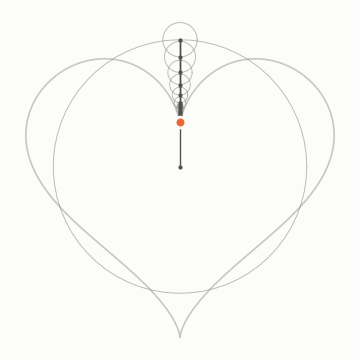
  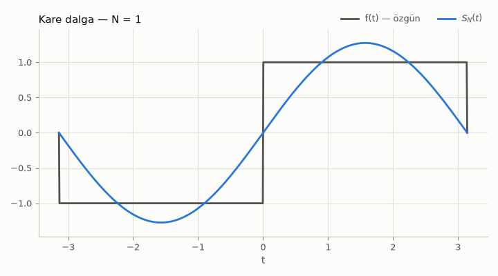
</p>

## Galeri

Görseller `python scripts/generate_gallery.py` ile üretilir (betik aynı zamanda matematiksel
sağlamalar yapar; bkz. [Galeri betiği](#galeri-betiği)).

| | |
|---|---|
| 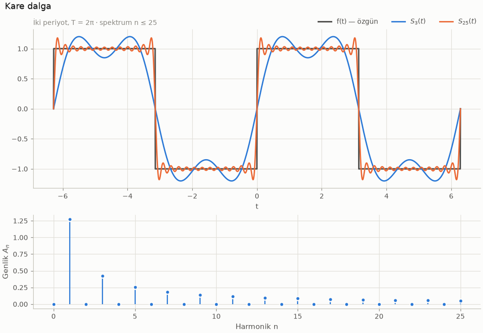 | 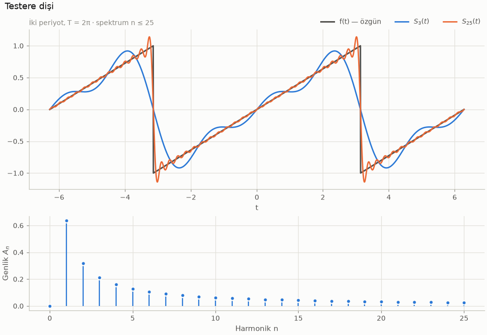 |
| 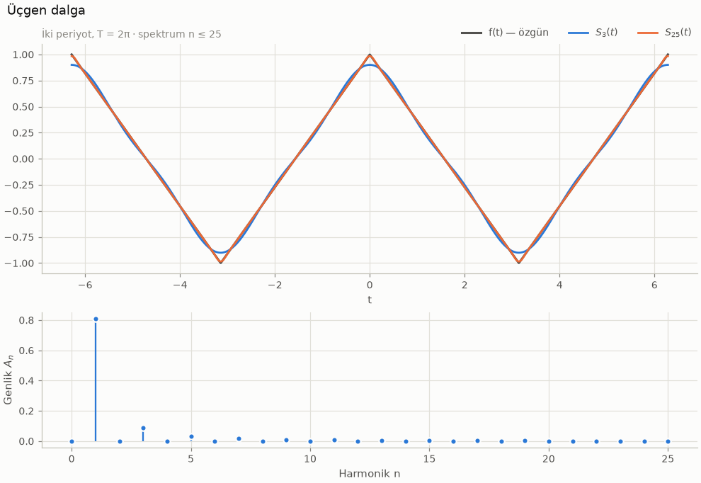 | 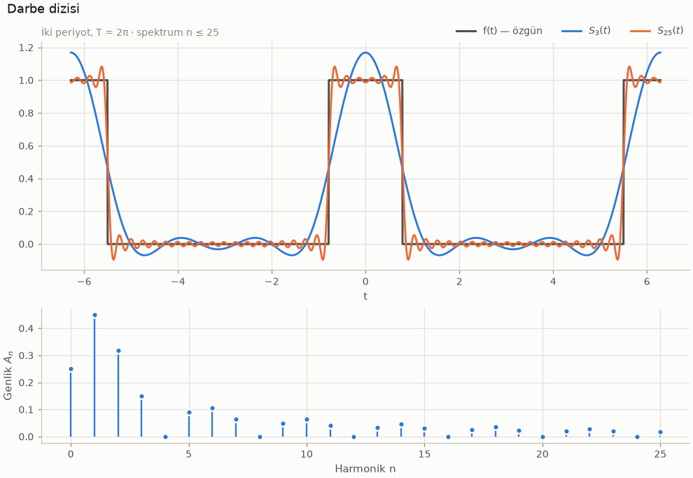 |
| 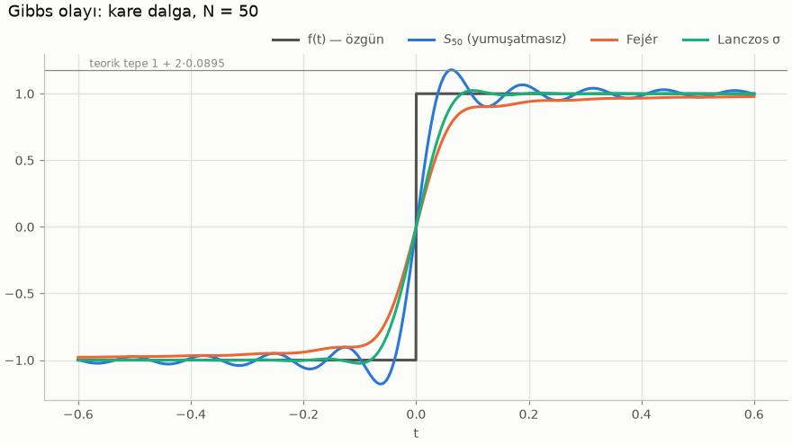 | 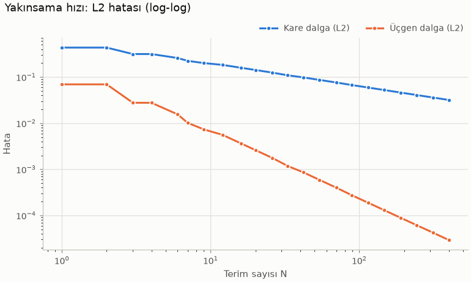 |

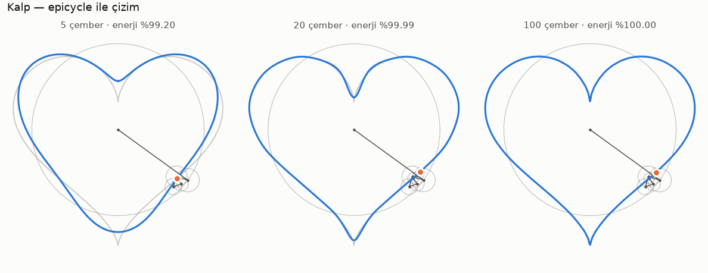
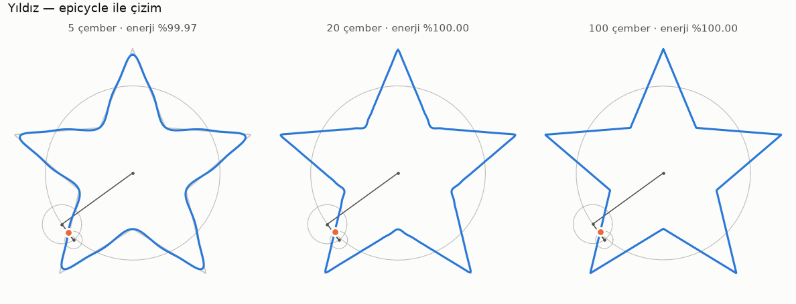
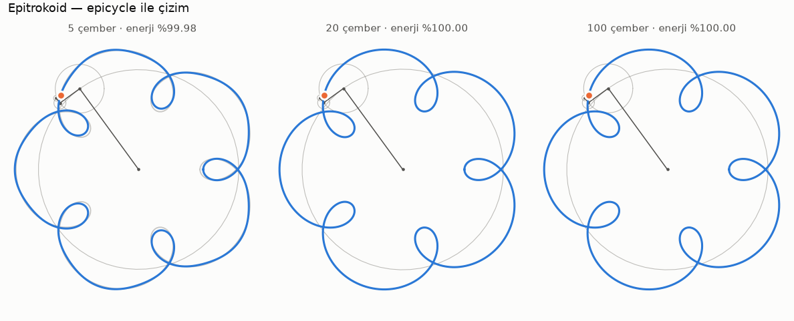

<details>
<summary>Diğer görseller</summary>

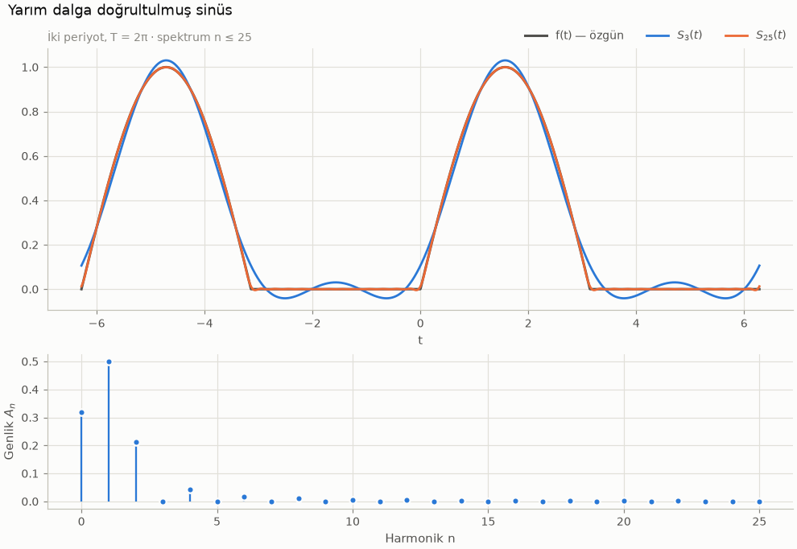
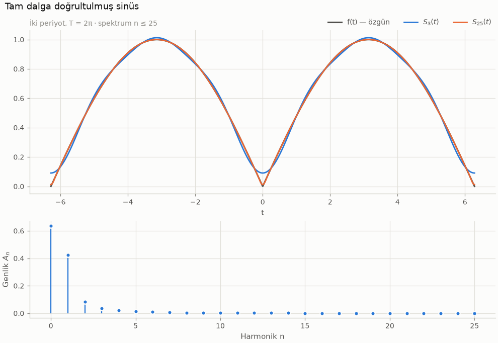
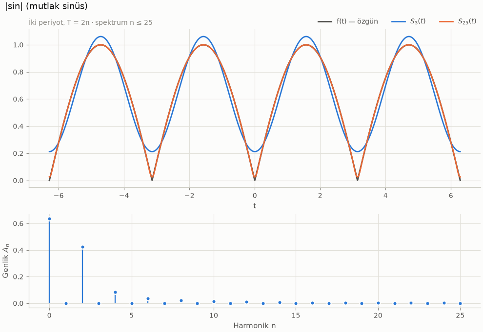
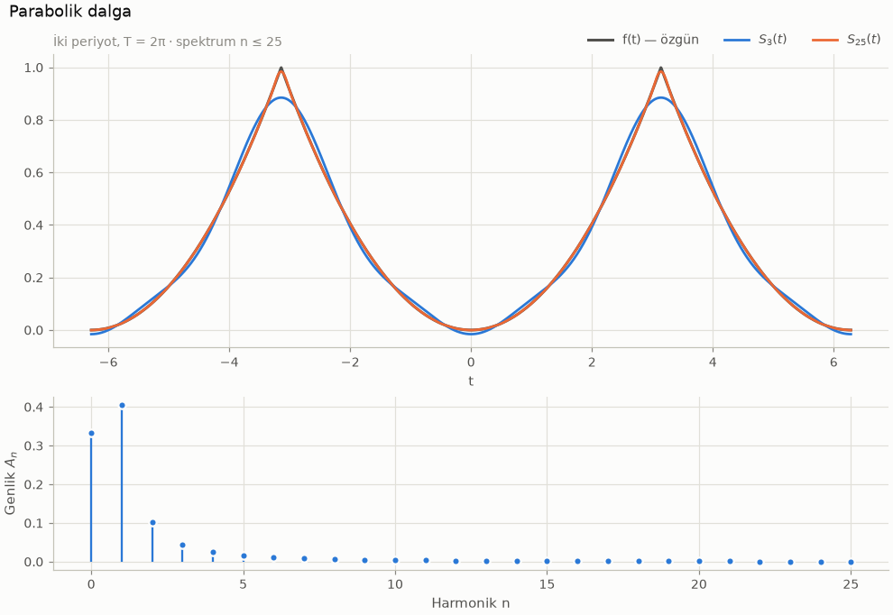
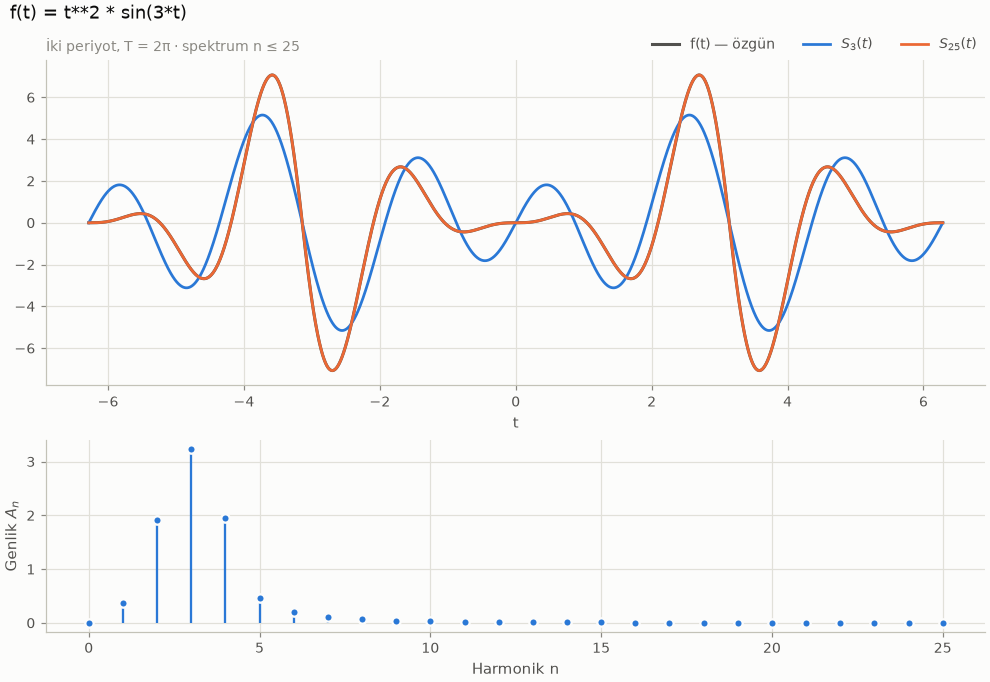
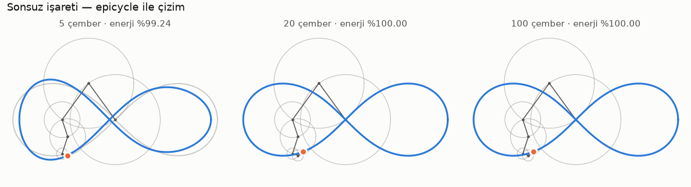
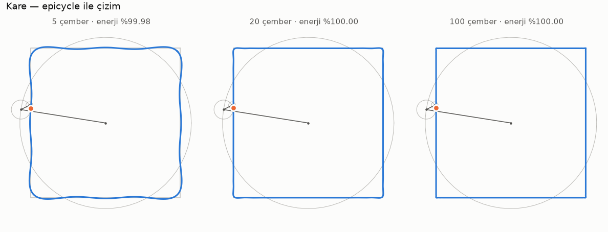
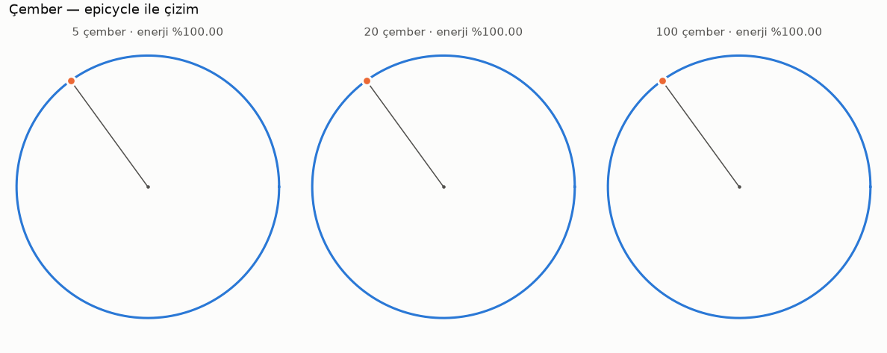

</details>

## Özellikler

**Arayüz (Streamlit, altı sekme, Türkçe):**

1. **📈 Fourier Serisi** — sinyal seçimi, N kaydırıcısı (1–500), özgün sinyal ve kısmi toplam aynı
   grafikte, harmonikleri ayrı katmanda gösterme, N arttıkça yakınsamayı gösteren oynatılabilir
   animasyon, sayısal ↔ analitik katsayı karşılaştırma tablosu, L2/maks. hata ve enerji metrikleri.
2. **🌀 Epicycles** — hazır şekiller (kalp, yıldız, sonsuz işareti, kare, epitrokoid, çember),
   **kement aracıyla serbest çizim** veya CSV/SVG yükleme; çember sayısı, hız, iz uzunluğu,
   çemberleri göster/gizle; dönen çemberlerin şekli çizdiği animasyon.
3. **📊 Spektrum** — tek taraflı ($A_n$, $\varphi_n$) veya çift taraflı ($|c_n|$, $\arg c_n$) genlik
   ve faz grafikleri (gövde/çubuk, log ölçek), Parseval kontrolü, katsayı tablosu.
4. **📉 Yakınsama ve Hata** — N'e göre L2 ve maksimum hata (log-log) ve eğimleri, Gibbs aşımının
   ölçülmesi ve teorik ≈ %8.95 ile karşılaştırılması, Fejér/Lanczos yumuşatma karşılaştırması,
   aşımın N ile değişimi.
5. **📚 Öğren** — katsayı formülleri, ortogonallik (etkileşimli Gram matrisi), Euler formülü ve
   karmaşık form, Parseval, Gibbs, yakınsama hızı ve epicycle'lar üzerine LaTeX'li kısa Türkçe
   notlar; her bölümden ilgili sekmeye geçiş düğmesi.
6. **💾 Dışa Aktar** — grafikler PNG, animasyonlar GIF/MP4, katsayılar ve epicycle'lar CSV/JSON
   (açık veya koyu temada).

**Diğer:** açık/koyu tema uyumu (Streamlit menüsü → *Settings* → *Theme*), ayarlar kenar
çubuğunda, ağır hesaplar `st.cache_data` ile önbellekte, yalnızca açık sekme hesaplanır,
hatalı girdide kullanıcı dostu Türkçe hata mesajları.

**Matematik çekirdeği:**

* Sayısal integralle $a_0, a_n, b_n$ (Gauss–Legendre, periyodik trapez, Simpson veya SciPy `quad`;
  hassasiyet ayarlanabilir) ve 8 hazır sinyal için **analitik** katsayılar.
* Karmaşık katsayılar $c_n$, gerçek ↔ karmaşık dönüşüm, zaman kayması.
* Vektörleştirilmiş kısmi toplam $S_N(t)$; tüm N değerleri için tek matris çarpımı.
* Fejér (Cesàro) ve Lanczos σ yumuşatması.
* L2/maks. hata, yakınsama eğimi, Gibbs aşımı ölçümü, Parseval, genlik/faz/güç spektrumu.
* 2D yollar için karmaşık DFT (tanım tabanlı doğrudan DFT + `numpy.fft`), genliğe göre sıralı
  epicycle'lar, eşit yay uzunluğuna göre yeniden örnekleme, SVG `path` ve CSV ayrıştırma.
* Kullanıcı ifadeleri için **`eval` kullanmayan**, AST beyaz listeli güvenli ayrıştırıcı.

## Kurulum

Python **3.11+** gerekir.

```bash
git clone https://github.com/alitokgoz7/fourier-visualizer.git
cd fourier-visualizer
python -m venv .venv
source .venv/bin/activate          # Windows: .venv\Scripts\activate
pip install -e ".[dev]"            # yalnızca uygulama için: pip install -e .
```

MP4 dışa aktarma için sistemde `ffmpeg` gerekmez; `imageio-ffmpeg` paketi gömülü bir ikili getirir.

## Çalıştırma

```bash
streamlit run fourier_viz/app/streamlit_app.py
```

Tarayıcıda `http://localhost:8501` açılır.

### Kendi ifadeniz

Kenar çubuğunda **Sinyal → ✏️ Kendi ifadem** seçip örneğin `t**2 * sin(3*t)` yazın. İfade bir
periyotta (`[−T/2, T/2)` veya `[0, T)`) tanımlanır ve periyodik olarak genişletilir.

| Öğe | İzin verilenler |
|---|---|
| Değişken | `t` |
| Sabitler | `pi` (`π`), `e`, `tau` (2π), sayılar (`2`, `0.5`, `1e-3`) |
| İşlemler | `+ - * / % **` (`^` de üs olarak kabul edilir), karşılaştırmalar `< <= > >= == !=`, `and`/`or`, `a if koşul else b` |
| Fonksiyonlar | `sin cos tan asin acos atan atan2 sinh cosh tanh exp log ln log10 log2 sqrt cbrt abs sign floor ceil round heaviside step sinc saw square triangle mod min max hypot where clip` |

Öznitelik erişimi (`os.system`), `__import__`, indeksleme, lambda, dizgeler vb. reddedilir.
NaN veya sonsuz değer üreten ifadeler (ör. `1/t`, `log(t)`) Türkçe bir hata mesajıyla bildirilir.

### Şekil çizme ve yükleme

* **Kendin çiz:** Epicycle ayarlarında *Kendin çiz (kement)* seçin; tuvalde kement aracıyla tek
  hamlede kapalı bir şekil çizin.
* **Dosya yükle:** her satırda `x, y` olan CSV (`;` ayırıcı ve ondalık virgül de desteklenir) veya
  `<path d="…">` içeren bir SVG yükleyin ya da SVG yol verisini doğrudan yapıştırın.

## Matematiksel arka plan (özet)

$\omega_0 = 2\pi/T$ olmak üzere

$$
f(t) \sim \frac{a_0}{2} + \sum_{n=1}^{\infty}\big[a_n\cos(n\omega_0 t) + b_n\sin(n\omega_0 t)\big],
\qquad
a_n = \frac{2}{T}\int_T f\cos(n\omega_0 t)\,dt,\quad b_n = \frac{2}{T}\int_T f\sin(n\omega_0 t)\,dt .
$$

* **Karmaşık form:** $f \sim \sum_n c_n e^{in\omega_0 t}$, $c_n = \frac1T\int_T f e^{-in\omega_0 t}dt$,
  $c_{\pm n} = (a_n \mp i b_n)/2$.
* **Parseval:** $\frac1T\int_T|f|^2 = (a_0/2)^2 + \frac12\sum(a_n^2+b_n^2) = \sum|c_n|^2$; bu yüzden
  L2 hatası N ile hiç artmaz.
* **Gibbs:** sıçramada aşım $\to \frac1\pi\operatorname{Si}(\pi) - \frac12 \approx 0.0895$ (≈ %8.95);
  Fejér yumuşatması aşımı yok eder, Lanczos σ ≈ %1.2'ye indirir.
* **Epicycle:** $z_m = x_m + iy_m$, $c_k = \mathrm{DFT}(z)_k/M$, $z(s) = \sum_k c_k e^{2\pi iks}$;
  her terim bir dönen çemberdir.

Ayrıntılar: [docs/matematik.md](docs/matematik.md) · Mimari: [docs/mimari.md](docs/mimari.md) ·
Geliştirme planı: [PLAN.md](PLAN.md)

## Proje yapısı

```
fourier_viz/
  core/
    types.py          tip takma adları
    integration.py    periyot üzerinde kareleme kuralları (Gauss, trapez, Simpson, quad)
    series.py         gerçek katsayılar, kısmi toplamlar, σ-yumuşatma
    complex_dft.py    karmaşık katsayılar, DFT/IDFT, epicycle'lar
    expression.py     güvenli (eval'siz) ifade ayrıştırıcı
    signals.py        sinyal kütüphanesi ve analitik katsayılar
    analysis.py       hata, yakınsama, Gibbs, Parseval, spektrum
    paths.py          2D şekiller, yay uzunluğu yeniden örnekleme, CSV
    svg.py            SVG path ayrıştırıcı
  viz/
    theme.py          açık/koyu palet
    plots.py          Plotly grafikleri ve animasyonları
    static.py         Matplotlib grafikleri (PNG, galeri)
    animation.py      GIF/MP4 dışa aktarma
  export.py           CSV/JSON dışa aktarma
  app/
    streamlit_app.py  giriş noktası
    sidebar.py        kenar çubuğu ayarları
    state.py          önbellekli hesaplamalar
    tabs.py           sekmeler
    learn.py          "Öğren" içeriği
scripts/generate_gallery.py
tests/                core/, viz/, app/, özellik tabanlı ve performans testleri
docs/                 matematik.md, mimari.md, gallery/
```

## Testler ve kalite kontrolleri

```bash
pytest                                   # tüm testler
pytest --cov=fourier_viz --cov-report=term-missing
coverage report --include="fourier_viz/core/*" --fail-under=90   # çekirdek kapsama eşiği
HYPOTHESIS_PROFILE=ci pytest             # daha fazla, deterministik hypothesis örneği
pytest -m "not slow and not perf"        # hızlı alt küme
ruff check . && ruff format --check .
mypy                                     # strict mod
```

Test paketi şunları doğrular: kare/testere/üçgen ve diğer sinyallerin analitik katsayıları,
sayısal ↔ analitik uyum, simetri, ortogonallik, Parseval, doğrusallık ve zaman kayması (hypothesis),
sürekli sinyallerde L2 hatasının monoton azalması, Gibbs aşımının ≈ %8.95 olması ve Fejér ile
kaybolması, sonlu harmonikli sinyallerin tam yeniden oluşturulması, DFT ↔ IDFT ve `numpy.fft`
uyumu, epicycle'ların şekli yeniden çizmesi, yeniden örneklemenin eşit aralıklı ve kapalı olması,
ifade ayrıştırıcının kötü niyetli girdileri reddetmesi, uç durumlar ve performans (< 1 sn).
Arayüz, `streamlit.testing.v1.AppTest` ile her sekme, sinyal, şekil ve hata yolu için test edilir.

GitHub Actions her push ve PR'da ruff, mypy, pytest (Python 3.11 ve 3.12, kapsama raporuyla) ve
galeri betiğinin matematik sağlamalarını çalıştırır.

## Galeri betiği

```bash
python scripts/generate_gallery.py                 # docs/gallery altına üretir
python scripts/generate_gallery.py --dark --out /tmp/galeri --no-animations
```

Betik her görseli üretirken sayısal/analitik katsayı farkını, Gibbs aşımını, yakınsama
eğimlerini ve epicycle hatalarının azaldığını denetler; bir denetim başarısız olursa sıfır
olmayan çıkış koduyla biter.

## Bilinen sınırlamalar

* SVG desteği `path` öğelerinin `d` özniteliğiyle sınırlıdır; `transform`, `<circle>`, `<rect>`
  gibi öğeler yok sayılır, birden çok alt yol sırayla birleştirilir.
* Kement çizimi tek bir kapalı poligon üretir; animasyonlarda performans için en fazla 80 çember
  çizilir (tüm vektörler hesaba katılır).
* Kullanıcı ifadelerindeki iç sıçramalar tarama + ikiye bölme ile otomatik bulunur (en fazla 64);
  bu sezgisel bir yöntemdir ve tarama ızgarasından (T/8192) dar sıçrama çiftlerini kaçırabilir.
  Aralıkta tanımsız veya sınırsız büyüyen ifadeler (ör. `1/t`, `tan(t)`, `log(t)`) —
  integre edilebilir tekillikler dahil — Türkçe bir hata mesajıyla reddedilir.
* Sayısal biçimler ondalık nokta kullanır (ör. `0.201`).
